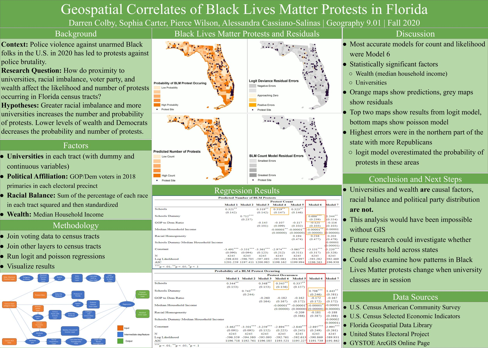

# Geospatial Correlates of #BLM Protests
Geospatial Correlates of #BLM Protests

Problem and Research Question: Recent police violence against unarmed black people in general, but more specifically against George Floyd has brought into national conversation the role of police and police oversight and triggered protests against police brutality. In our project, we seek to understand the ways in which proximity to postsecondary institutions and the spatial distributions of political party members, median household income, and race affect the likelihood of a protest occurring. In the course of our analysis, we plan to create layers for each of these factors in the vector model, perform spatial joins where necessary to correct topological issues and to aggregate these factors into a single layer from which we can create buffers around protests and examine their proximities to the above factors. From this initial analysis, we will estimate a logistic regression with the above variables as predictors and the likelihood of a protest as the response variable. Then, we will create a choropleth map and classify each municipality based on the estimated likelihood of a protest occurring.

Factors Considered: The project examines the proximity of protests to postsecondary institutions and the spatial distributions of political party members, median household income, and racial homogeneity. To operationalize political party, we use the ratio of registered Republican to Democrat voters in each municipality. We operationalize race by creating an index for each census tract that is the normalized sum of the squared proportion of each race in a census tract.

Output: The outputs that answer these questions are logistic and Poisson regressions that estimate the probability and number of protests in each census tract along with a series of mas that depict geospatial patterns.

